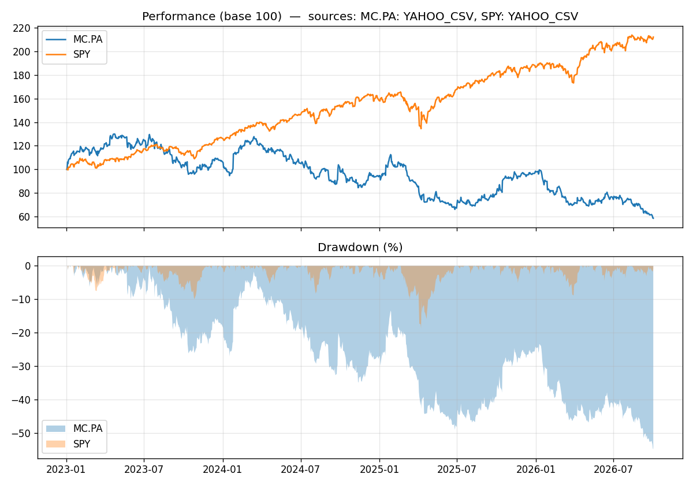

# Market Data, Risk & Portfolio Analytics in SQL

A small SQLite project where I store daily prices for LVMH (`MC.PA`) and the S&P 500 ETF (`SPY`), then compute risk metrics and portfolio PnL mostly in SQL (window functions, a recursive CTE and views). I check the SQL results against an independent pandas calculation with unit tests.

> **About the data:** the prices come from Yahoo Finance (downloaded with `yfinance`). Each asset has a `data_source` column (`YAHOO_CSV` or `SIMULATED`). The build refuses to create fake prices unless you pass `--simulate`, and the chart title shows the source. The numbers below depend on the day the CSV files were downloaded.

## What it does

| Part | File / view | Content |
|---|---|---|
| Schema | `sql/schema.sql` | `assets`, `daily_prices`, `transactions`, `CHECK` constraints (consistent OHLC, prices > 0), trigger that blocks selling more than you hold |
| Returns & trend | `v_returns` | daily return (`LAG`), intraday range, 20 and 50 day moving averages (NULL until the window is full) |
| Drawdown | `v_drawdown` | running high-water mark (`MAX() OVER`) and current drawdown |
| Risk | `v_risk_summary` | CAGR, annualised volatility, Sharpe ratio, max drawdown, Calmar ratio (252 days, risk-free rate in the `params` table) |
| Co-movement | `v_correlation` | correlation and beta for each pair of assets, on common dates |
| Portfolio | `sql/portfolio.sql` | weighted average cost (PRU) with a recursive CTE, **BUY and SELL**, realized and unrealized PnL, fees included |

Everything uses `adjusted_close` (dividends and splits). There is no rounding inside the calculations: `ROUND` is only used for display.

## Quickstart

```bash
python3 -m venv .venv
source .venv/bin/activate          # on Windows: .venv\Scripts\activate
pip install -r requirements.txt

python3 fetch_prices.py MC.PA SPY  # downloads data/prices/MC.PA.csv and SPY.csv
python3 build_db.py                # builds market_data.db from the CSV files
python3 report.py                  # prints the tables and saves docs/dashboard.png
python3 -m unittest discover -s tests -v
```

No internet? `python3 build_db.py --simulate` builds a demo database with random prices. Those rows are labelled `SIMULATED`, so don't read anything into the results.

You can also query the views directly:

```bash
sqlite3 -header -column market_data.db "SELECT * FROM v_risk_summary"
```

## Example output (Yahoo Finance data, Jan 2023 to Oct 2026)

```
ticker data_source  cagr_pct  ann_vol_pct  sharpe  max_drawdown_pct  calmar
 MC.PA   YAHOO_CSV    -13.06        29.17   -0.33            -54.79   -0.24
   SPY   YAHOO_CSV     22.30        14.92    1.42            -18.76    1.19
```

Over this period MC.PA lost value while SPY gained. Their daily returns have a correlation of 0.21 and MC.PA has a beta of 0.42 against SPY (929 common trading days).



## Design choices

- **Indexes:** `UNIQUE(asset_id, trade_date)` already creates the composite index, so I did not add a duplicate one (a test checks this). Only `transactions` has its own index.
- **Re-runnable:** `build_db.py` rebuilds the database from scratch, so running it twice never duplicates rows.
- **Sample trades use real prices:** each order in `sql/seed_transactions.sql` is executed at the real closing price of the first trading day on or after the chosen date.
- **Dates:** Paris and New York have different holidays, so correlation and beta are computed only on dates where both markets traded.
- **No currency conversion:** `v_positions` shows one row per asset in its own currency. Adding EUR and USD together would need an `fx_rates` table.

## Limitations

- Weighted average cost only (no FIFO).
- No cash dividends and no short selling.
- Only two assets, so correlation is a single pair.
- Past performance of two stocks says nothing about the future; this is a data engineering exercise, not investment advice.

## Ideas for next steps

An `fx_rates` table to value the portfolio in EUR, FIFO as an alternative cost method, historical VaR (percentiles), and a benchmark with alpha.
